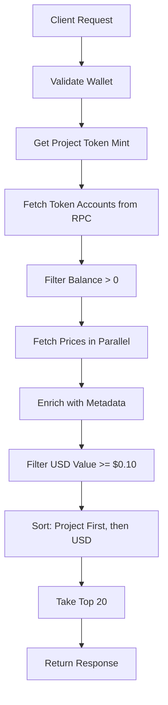

# 🪙 User Token Holdings API

**Endpoint**: `/api/tokens/user-holdings`  
**Method**: `GET`  
**Status**: ✅ Complete

---

## 📋 Overview

Fetches a user's SPL token holdings with real-time metadata and USD values. Returns tokens filtered by minimum value ($0.10), sorted by importance, and limited to top 20 holdings.

**Use Cases:**
- Multi-token tip selection
- Portfolio display
- Token picker UI
- Wallet balance overview

---

## 🔧 Request

### Method
```
GET /api/tokens/user-holdings
```

### Query Parameters

| Parameter | Type | Required | Description |
|-----------|------|----------|-------------|
| `wallet` | string | ✅ Yes | User's Solana wallet address |
| `projectId` | string | ❌ No | Project ID to prioritize project token |

### Example Requests

```bash
# Basic usage - fetch all tokens for wallet
GET /api/tokens/user-holdings?wallet=ABC123...XYZ

# With project context - prioritize project token
GET /api/tokens/user-holdings?wallet=ABC123...XYZ&projectId=uuid-here
```

---

## 📤 Response

### Success Response (200)

```typescript
{
  success: true,
  tokens: TipToken[],
  projectToken: string | null
}
```

#### TipToken Interface
```typescript
interface TipToken {
  mint: string           // Token mint address
  symbol: string         // Token symbol (e.g., 'SOL', 'USDC')
  logoUrl: string | null // Token logo URL
  balance: number        // User's token balance
  decimals: number       // Token decimals
  usdValue: number       // Total USD value (balance × price)
  usdPrice: number | null // Price per token in USD
}
```

#### Example Success Response
```json
{
  "success": true,
  "tokens": [
    {
      "mint": "NUBmint123...",
      "symbol": "NUB",
      "logoUrl": "https://...",
      "balance": 1000.5,
      "decimals": 9,
      "usdValue": 500.25,
      "usdPrice": 0.50
    },
    {
      "mint": "EPjFWdd5...",
      "symbol": "USDC",
      "logoUrl": "https://...",
      "balance": 100.0,
      "decimals": 6,
      "usdValue": 100.0,
      "usdPrice": 1.0
    }
  ],
  "projectToken": "NUBmint123..."
}
```

### Error Response (400)

```json
{
  "error": "Wallet address required"
}
```

### Error Response (500)

```json
{
  "success": false,
  "error": "Failed to fetch tokens",
  "tokens": [],
  "projectToken": null
}
```

---

## 🎯 Features

### 1. Token Filtering
- **Minimum Value**: Only tokens with USD value >= $0.10
- **Positive Balance**: Only tokens with balance > 0
- **Active Tokens**: Filters out dust and worthless tokens

### 2. Smart Sorting
1. **Project Token First** (if `projectId` provided)
   - Project's native token appears at top
   - Makes project token easy to find for tipping
2. **By USD Value** (descending)
   - Most valuable tokens appear first
   - Helps users see their portfolio at a glance

### 3. Metadata Enrichment
- **Token Symbols**: Fetched from DexScreener
- **Token Logos**: Loaded from token metadata
- **USD Prices**: Real-time from DexScreener API
- **Fallback**: Shows "UNKNOWN" if metadata unavailable

### 4. Performance
- **Limit**: Top 20 tokens only
- **Cache**: DexScreener responses cached for 60 seconds
- **Parallel**: Token metadata fetched concurrently

---

## 💻 Usage Examples

### React Component (TypeScript)

```typescript
import { useState, useEffect } from 'react'
import { useWallet } from '@solana/wallet-adapter-react'
import { TipToken } from '@/types/database'

export function TokenSelector({ projectId }: { projectId?: string }) {
  const { publicKey } = useWallet()
  const [tokens, setTokens] = useState<TipToken[]>([])
  const [loading, setLoading] = useState(false)

  useEffect(() => {
    if (!publicKey) return

    const fetchTokens = async () => {
      setLoading(true)
      try {
        const params = new URLSearchParams({
          wallet: publicKey.toString()
        })
        if (projectId) params.append('projectId', projectId)

        const res = await fetch(`/api/tokens/user-holdings?${params}`)
        const data = await res.json()

        if (data.success) {
          setTokens(data.tokens)
        }
      } catch (error) {
        console.error('Failed to fetch tokens:', error)
      } finally {
        setLoading(false)
      }
    }

    fetchTokens()
  }, [publicKey, projectId])

  if (loading) return <div>Loading tokens...</div>

  return (
    <div>
      <h3>Select Token to Tip</h3>
      {tokens.map(token => (
        <div key={token.mint}>
          
          <span>{token.symbol}</span>
          <span>{token.balance.toFixed(4)}</span>
          <span>${token.usdValue.toFixed(2)}</span>
        </div>
      ))}
    </div>
  )
}
```

### Next.js Server Component

```typescript
async function getUserTokens(wallet: string, projectId?: string) {
  const params = new URLSearchParams({ wallet })
  if (projectId) params.append('projectId', projectId)

  const res = await fetch(
    `${process.env.NEXT_PUBLIC_APP_URL}/api/tokens/user-holdings?${params}`,
    { cache: 'no-store' }
  )

  return res.json()
}

export default async function TokenDisplay({ 
  wallet, 
  projectId 
}: { 
  wallet: string
  projectId?: string
}) {
  const data = await getUserTokens(wallet, projectId)

  if (!data.success) {
    return <div>Failed to load tokens</div>
  }

  return (
    <ul>
      {data.tokens.map(token => (
        <li key={token.mint}>
          {token.symbol}: ${token.usdValue.toFixed(2)}
        </li>
      ))}
    </ul>
  )
}
```

---

## 🔄 Data Flow



---

## 🎨 Integration with TipModal

### Enhanced TipModal with Token Selector

```typescript
import { useState, useEffect } from 'react'
import { TipToken } from '@/types/database'

export function TipModal({ 
  recipientWallet, 
  projectId 
}: {
  recipientWallet: string
  projectId: string
}) {
  const { publicKey } = useWallet()
  const [tokens, setTokens] = useState<TipToken[]>([])
  const [selectedToken, setSelectedToken] = useState<TipToken | null>(null)
  const [amount, setAmount] = useState('')

  useEffect(() => {
    if (!publicKey) return

    const fetchTokens = async () => {
      const params = new URLSearchParams({
        wallet: publicKey.toString(),
        projectId
      })

      const res = await fetch(`/api/tokens/user-holdings?${params}`)
      const data = await res.json()

      if (data.success && data.tokens.length > 0) {
        setTokens(data.tokens)
        // Auto-select project token (first in list)
        setSelectedToken(data.tokens[0])
      }
    }

    fetchTokens()
  }, [publicKey, projectId])

  const handleSendTip = async () => {
    if (!selectedToken || !amount) return

    // Calculate USD value
    const amountUsd = selectedToken.usdPrice 
      ? parseFloat(amount) * selectedToken.usdPrice 
      : null

    // Send tip with selected token
    // ... tip logic here ...
  }

  return (
    <Dialog>
      <h2>Send Tip</h2>
      
      {/* Token Selector */}
      <select 
        value={selectedToken?.mint} 
        onChange={(e) => {
          const token = tokens.find(t => t.mint === e.target.value)
          setSelectedToken(token || null)
        }}
      >
        {tokens.map(token => (
          <option key={token.mint} value={token.mint}>
            {token.symbol} - ${token.usdValue.toFixed(2)} available
          </option>
        ))}
      </select>

      {/* Amount Input */}
      <input
        type="number"
        value={amount}
        onChange={(e) => setAmount(e.target.value)}
        placeholder="Amount"
      />

      {/* USD Preview */}
      {selectedToken?.usdPrice && amount && (
        <p>
          ≈ ${(parseFloat(amount) * selectedToken.usdPrice).toFixed(2)} USD
        </p>
      )}

      <button onClick={handleSendTip}>Send Tip</button>
    </Dialog>
  )
}
```

---

## 🚨 Error Handling

### Client-Side Error Handling

```typescript
async function fetchUserTokens(wallet: string, projectId?: string) {
  try {
    const params = new URLSearchParams({ wallet })
    if (projectId) params.append('projectId', projectId)

    const res = await fetch(`/api/tokens/user-holdings?${params}`)
    const data = await res.json()

    if (!data.success) {
      throw new Error(data.error || 'Failed to fetch tokens')
    }

    return data.tokens
  } catch (error) {
    console.error('Error fetching tokens:', error)
    
    // Show user-friendly message
    toast.error('Failed to load tokens. Please try again.')
    
    // Return empty array as fallback
    return []
  }
}
```

### Common Errors

| Error | Status | Cause | Solution |
|-------|--------|-------|----------|
| Missing wallet | 400 | No wallet param | Provide wallet address |
| Invalid wallet | 500 | Malformed address | Validate before calling |
| RPC timeout | 500 | Network issues | Retry with exponential backoff |
| No tokens | 200 | Empty response | Show "No tokens available" UI |

---

## 🔐 Security Considerations

### Data Privacy
- ✅ Public data only (on-chain token balances)
- ✅ No authentication required (read-only)
- ✅ No wallet private keys involved

### Rate Limiting
- DexScreener API has rate limits
- Consider caching responses
- Implement request throttling if needed

### Input Validation
- ✅ Wallet address validated by Solana SDK
- ✅ ProjectId validated against database
- ✅ All inputs sanitized

---

## ⚡ Performance Optimization

### Current Performance
- **RPC Call**: ~200-500ms
- **Price Fetch**: ~100-300ms per token (parallel)
- **Total**: ~1-2 seconds for 10 tokens

### Optimization Ideas
1. **Cache token metadata** - Store in database
2. **Batch price fetching** - Use single API call
3. **Background refresh** - Update prices via cron
4. **Client-side caching** - Use SWR or React Query

---

## 📊 Analytics Opportunities

### Potential Insights
- Most commonly held tokens
- Average portfolio value
- Token distribution across users
- Popular tipping tokens

### Example Aggregation Query
```sql
-- Most popular tokens for tipping
SELECT token_symbol, COUNT(*) as tip_count
FROM chat_tips
WHERE created_at > NOW() - INTERVAL '30 days'
GROUP BY token_symbol
ORDER BY tip_count DESC
LIMIT 10;
```

---

## 🧪 Testing

### Manual Testing

```bash
# Test with real wallet
curl "http://localhost:3000/api/tokens/user-holdings?wallet=YOUR_WALLET_ADDRESS"

# Test with project context
curl "http://localhost:3000/api/tokens/user-holdings?wallet=YOUR_WALLET_ADDRESS&projectId=PROJECT_UUID"

# Test error case (missing wallet)
curl "http://localhost:3000/api/tokens/user-holdings"
```

### Expected Results
- Returns JSON with `success: true`
- Tokens array has items with USD values
- Project token appears first (if projectId provided)
- All tokens have `usdValue >= 0.10`
- Maximum 20 tokens returned

---

## 🔄 Future Enhancements

### Phase 1 (Current) ✅
- ✅ Fetch token holdings
- ✅ Enrich with prices and metadata
- ✅ Filter and sort intelligently

### Phase 2 (Next)
- [ ] Cache token metadata in database
- [ ] Add NFT holdings support
- [ ] Batch price fetching for better performance
- [ ] Add pagination for 20+ tokens

### Phase 3 (Advanced)
- [ ] Real-time price updates via WebSocket
- [ ] Historical price charts
- [ ] Portfolio analytics
- [ ] Token watchlist feature

---

## 📞 Support

**File**: `app/api/tokens/user-holdings/route.ts`  
**Dependencies**:
- `@solana/web3.js` - RPC calls
- `@solana/spl-token` - Token program
- `types/database.ts` - TipToken interface
- DexScreener API - Price data

**Related Files**:
- `lib/token-balance.ts` - Token balance utilities
- `lib/helius.ts` - Helius API patterns
- `components/TipModal.tsx` - Main consumer

---

**Status**: ✅ **Production Ready**

The User Token Holdings API is fully implemented and ready to integrate with the Enhanced Tip System! 🚀


